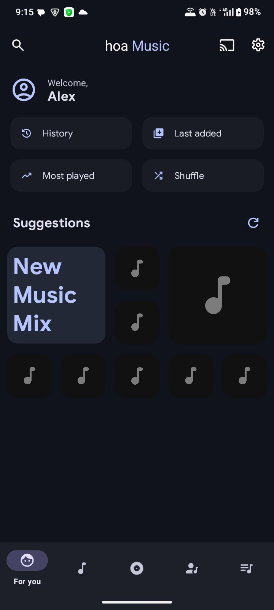
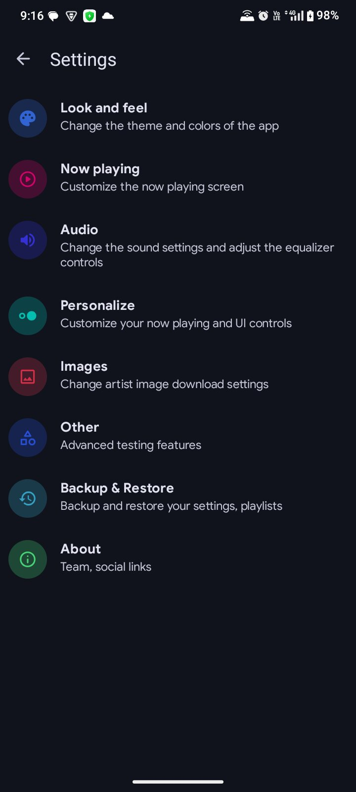
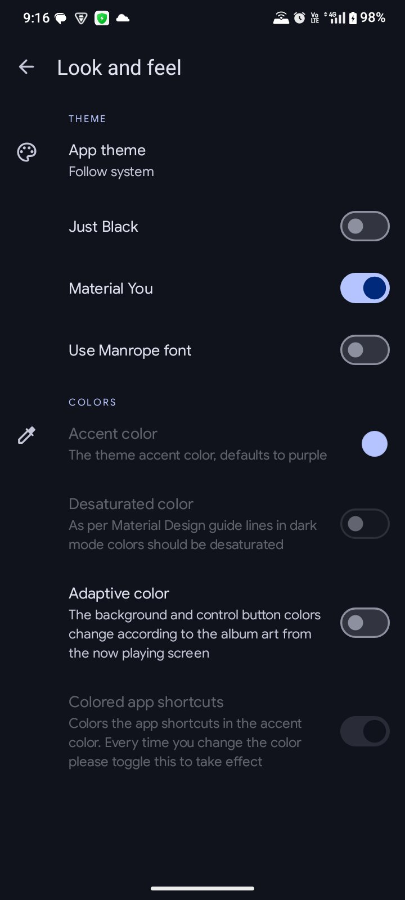
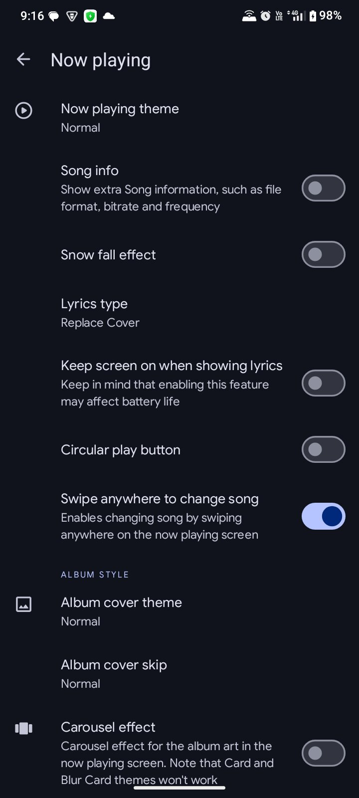
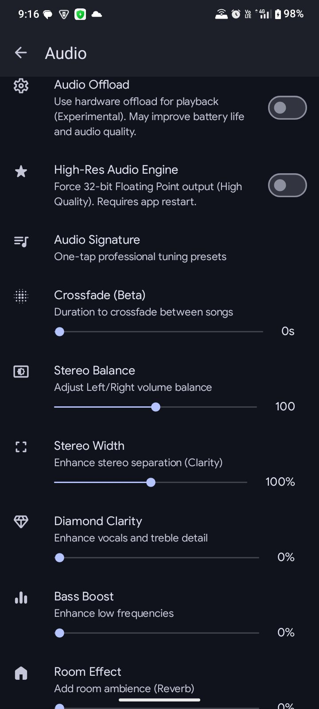

  

<h1 align="center">HOA Music Player Pro</h1>

  <strong>The Ultimate Mastering-Grade Audiophile Experience for Android</strong>

  
  
  
  

  <a href="#-advanced-holophonic-audio-engine">Audio Engine</a> •
  <a href="#-signature-audio-presets">Presets</a> •
  <a href="#-screenshots">Screenshots</a> •
  <a href="#-technical-mastery">Architecture</a> •
  <a href="#-faq">Support</a>

---

## 💎 Professional Audiophile Experience
**HOA Music Player Pro** is a high-fidelity local music player engineered for users who demand studio-quality sound on mobile. Built with a Material You design philosophy, it features a **Mastering-Grade Audio Engine** that utilizes **32-bit Floating Point DSP Modeling**. By simulating high-end analog hardware and complex psychoacoustic environments, HOA delivers a truly "Physical" music experience.

---

## 📸 Screenshots

  
  
  
  
  

---

## 🚀 Advanced Holophonic Audio Engine (v9.0)
Our custom-built DSP suite transforms your mobile device into a professional studio signal path, optimized specifically for high-fidelity headphone listening.

- **🔊 True 8D Spherical HRTF Matrix**: A 360-degree binaural engine that models physical Pinna-filtering cues (Front, Back, Up, Down). It creates a massive, high-resolution acoustic pocket, making instruments feel physically present in a 3D space.
- **🥁 Apex Kinetic Bass Engine**: Features **8th-Order Linkwitz-Riley isolation** and **250Hz Surgical Mud-Carving**. It extracts only the purest sub-frequencies for a bone-crushing punch without the "wavy" frequency leakage.
- **🌊 Surgical Sub-Harmonic Synthesis**: Generates solid, 3rd-order Chebyshev harmonics specifically in the <90Hz region for grounded, chest-pounding weight that doesn't increase digital peak volume.
- **🛡️ Discrete Band Mastering**: Eliminates "Volume Ducking" by limiting the bass band independently from the master signal. Your vocals and instruments stay 100% loud even at maximum bass strength.
- **🛠️ Low-Bitrate Audio Restoration**: Automatically "repairs" low-quality MP3s using spectral brightness detection and high-end harmonic reconstruction to rebuild lost detail in real-time.
- **↔️ Universal Horizon Stadium Depth**: Merges long-distance virtual reflections (up to 35ms) with the directional 8D matrix for an infinite stadium feel without phase-smearing.
- **🎧 Mono-Bass Crossover**: Integrated a 150Hz mono-summing stage to keep sub-frequencies centered and solid while the rest of the mix expands wide.
- **✨ Bit-Depth Dither Reconstruction**: Adds high-frequency dither to standard 16-bit files, simulating the smooth, noise-free background of 32-bit High-Res audio.

---

## 🏗️ Deep Dive: The Signal Path
HOA Pro uses a non-linear serial-parallel processing chain to maintain maximum fidelity:

1.  **Bit-Perfect Input**: Decoding of FLAC, ALAC, WAV, and MP3 into a 32-bit float buffer.
2.  **Surgical Isolation**: Splitting frequencies into 3 independent zones (Sub, Thump, Texture) for targeted enhancement.
3.  **Holophonic Matrix**: Application of the 6-tap 8D delay matrix with physical ear-shadow simulation.
4.  **Analog Saturation**: Soft-clipping stage using asymmetric curves to add "warmth" and "even-order harmonics."
5.  **Discrete Band Limiting**: Final look-ahead stage to ensure maximum Raw Volume without digital "cracking" or ducking.

---

## 🎚️ Signature Audio Presets
One-tap professional tunings to instantly transform your sound:

| Preset | DSP Characteristics | Recommended For |
| :--- | :--- | :--- |
| **3D Spatial (8D)** | 360° HRTF Spherical Matrix | Electronic, Ambient, 8D Tracks |
| **The HOA Signature** | Balanced Studio Sound + High-Shelf Clarity | General Listening, Rock, Pop |
| **Bass Head** | Heavy Surgical Bass + 250Hz Mud-Cut | Hip-Hop, EDM, Trap |
| **Vocal Air** | +8dB "Diamond" Air Exciter (>12kHz) | Acoustic, Jazz, Podcasts |
| **Live Stadium** | Universal Horizon Matrix + 35ms Taps | Stadium Concerts, Orchestral |
| **Vinyl Warmth** | Thick Analog Tape Saturation | Lo-fi, Classic Rock, Blues |

---

## 🎨 Modern Design & UX
- **Material You Dynamic Color**: The entire app's color palette (buttons, accents, backgrounds) adapts to your current wallpaper using the Monet engine.
- **Precision UI Controls**: Added **(+) and (-)** buttons to all audio sliders for 1% increment professional fine-tuning.
- **Edge-to-Edge Experience**: Fully immersive UI that flows behind the status and navigation bars.
- **Hardware-Accelerated Blurs**: Real-time glassmorphism and background blurs for a premium look and feel.

---

## 📦 Extended Feature Suite
- **Advanced Playback**: Gapless playback, crossfade (0-10s), and variable playback speed/pitch.
- **Connectivity**: Full support for Chromecast, Android Auto, and Bluetooth metadata (AVRCP).
- **Lyrics Engine**: Support for embedded and external `.lrc` files with a high-precision synced lyrics renderer.
- **Metadata Pro**: Powerful tag editor for ID3v1, ID3v2, Vorbis, and MP4 tags including high-resolution artwork embedding.
- **Smart Playlists**: Auto-generated lists for "Recently Added," "Most Played," and "Recently Played."

---

## 🛠️ Technical Mastery
- **32-Bit Float Engine**: Prevents rounding errors during complex DSP calculations, ensuring "Black" backgrounds and zero noise.
- **Discrete Mastering Pipeline**: Uses independent processing paths for bass and treble to preserve maximum dynamic range.
- **Battery Efficiency**: DSP algorithms are written in high-performance Kotlin paths to minimize CPU wake-locks.
- **Modern Stack**: Built with **Kotlin Coroutines**, **Koin DI**, **Navigation Component**, and **Media3/ExoPlayer**.

---

## ❓ FAQ

### 🎧 Audio & Effects
**Q: How do I enable the High-Res Audio Engine?**
A: Go to **Settings > Audio** and toggle "High-Res Audio Engine". (Requires app restart).

**Q: Why does the 3D Spatial mode sound so different?**
A: It's a **Binaural Holophonic Matrix** that uses physical HRTF cues to trick your brain into perceiving direction (Up/Down/Front/Back).

**Q: Does it support Hi-Res files?**
A: Yes. HOA natively supports 24-bit and 32-bit FLAC/WAV files, provided your hardware's DAC can output them.

### 📂 Library & Files
**Q: Why aren't my songs showing up?**
- Check **Settings > Other > Filter song duration** (set to 0).
- Use **Settings > Library > Rescan**.
- Ensure files are in a supported format (MP3, FLAC, M4A, WAV, etc.).

---

## 🤝 Contributing
Contributions are what make the open-source community such an amazing place to learn, inspire, and create.

1. Fork the Project
2. Create your Feature Branch (`git checkout -b feature/AmazingFeature`)
3. Commit your Changes (`git commit -m 'Add some AmazingFeature'`)
4. Push to the Branch (`git push origin feature/AmazingFeature`)
5. Open a Pull Request

---

## 🗂️ License
Distributed under the **GNU General Public License v3.0**. See `LICENSE.md` for more information.

---

  Made with ❤️ for Music Lovers • <a href="https://github.com/helpofai/HOA-Music-Player-Pro">GitHub</a>

